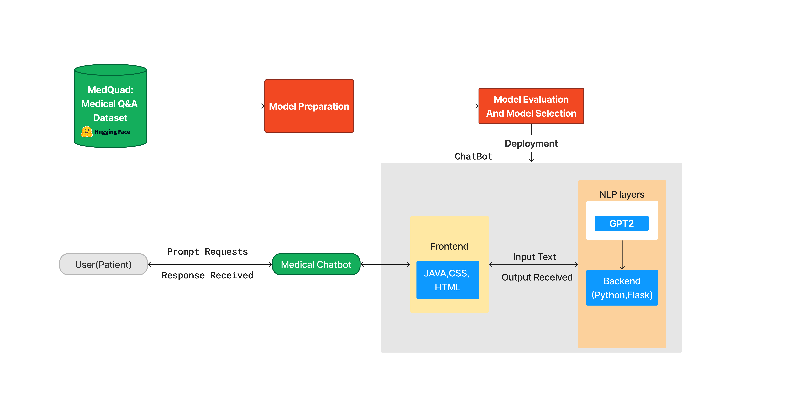
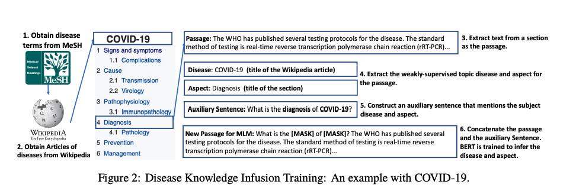
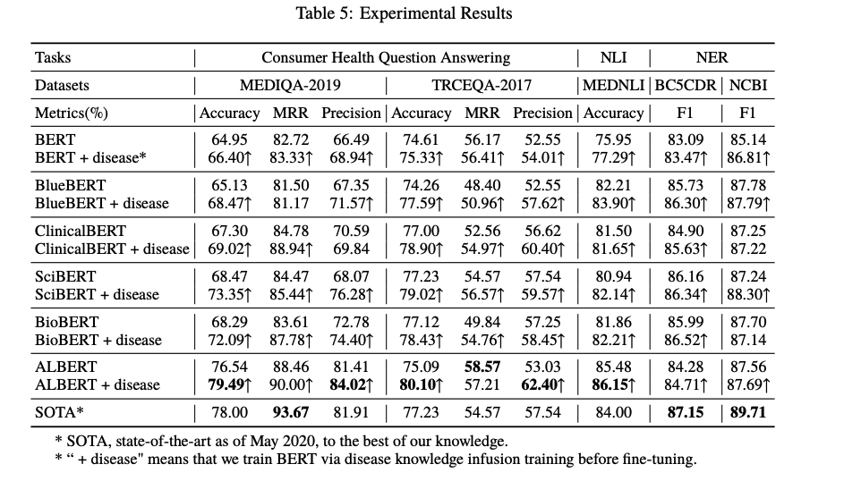
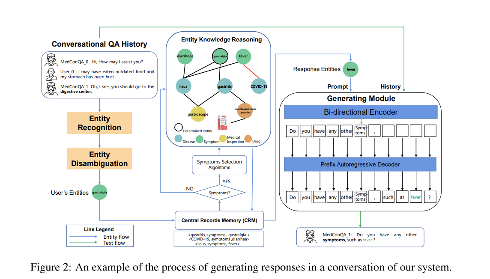
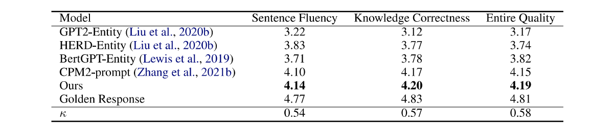

# 🤖 MedBot: AI-Powered Healthcare Companion

## 🌟 Overview
MedBot is an innovative medical chatbot leveraging advanced AI and Natural Language Processing to provide accessible, reliable healthcare information. Our system empowers users with instant access to medical knowledge while maintaining high accuracy and user privacy.

## Problems

- Limited Access to Healthcare Professionals: Long wait times for appointments,overburdened healthcare systems, geographical barriers and financial constraints results in the limited access to healthcare professionals
- Delayed Medical Attention: Lack of awareness or understanding of the seriousness of symptoms contributes to delayed medical attention, especially in case of Cancer.
- Technological problems: Traditional chatbots were rule-based and had limited understanding of natural languages and inability to learn and adapt which resulted in limited accuracy.

## Solutions

The key factors to deploy medical chatbots include scalability, availability, data collection, instant information provision, and cost efficiency.
- Scalability: Efficiently handles increased demand without compromising quality
- Availability: Provides 24/7 instant support for patients
- Data Collection: Analyzes patient data for informed insights and personalized care
- Instant Information: Offers rapid and accurate responses to inquiries
- Cost Efficiency: Optimizes operations, reduces costs, and streamlines tasks

## 🎯 Research Context
### Related Works Analysis

#### 1. Buoy Health Interface

#### 2. Ada Health Platform

## 🛠 System Architecture
### Complete Framework Overview

## 🔬 Methodology & Implementation

### 1. Data Collection and Preprocessing

#### Datasets
- Sources: Leverage the MedQuad dataset and supplementary datasets from Huggingface and GitHub.

#### Data Preprocessing 
- We have used the GPT2TokenizerFast from the transformers library to tokenize text efficiently for processing with the GPT-2 model.
- Similarly, for the seq2seq model, we’re using NLTK library for carrying out the tokenization.
- Dataset is further splitted into training, validation and testing pairs on 80%, 10%, and 10% respectively

### 2. Model Development

- We have trained 2 models: Seq2Seq and GPT2.
- Integrate advanced NLP techniques like validation and perplexity,adaptation validation seq2seq for high quality performance.

### 3. Experimental Design

We conducted experiments to train and fine-tune two models, namely GPT-2 and Seq2Seq, for medical question-answering (QA) tasks. Below are the details of the experimental design and hyperparameters used for each model:

#### a. GPT-2 Model:
- Training Data: We utilized a dataset consisting of 143,250 samples for training the GPT-2 model.
- Fine-tuning: The GPT-2 model was fine-tuned on medical QA data to adapt it specifically for medical-related inquiries.
Hyperparameters for Fine-Tuning:
- Evaluation Strategy: Epoch-based evaluation
- Learning Rate: 2e-5
- Weight Decay: 0.01
- Number of Training Epochs: 3

#### b. Seq2Seq Model:
-Training Data: Similar to the GPT-2 model, we used the same dataset containing 143,250 samples for training the Seq2Seq model.
Hyperparameters:
- Hidden Layers: 512
- Number of Iterations: 15,000
- Teacher Forcing Ratio: 0.5
- Learning Rate Encoder: 0.0001
- Learning Rate Decoder: 0.0005
- Optimizer: Adam Optimizer

Both models were trained using these hyperparameters to optimize their performance for medical question-answering tasks. The choice of hyperparameters was based on experimentation and empirical observations to achieve a balance between model complexity, training efficiency, and task-specific requirements. Additionally, the evaluation strategy for both models involved monitoring performance metrics such as accuracy, loss, and convergence over the specified number of training epochs.

### 4. Evaluation

- Apply a suite of metrics, including BLEU, ROGUE.
- Expand evaluation to include precision, recall, and F1-score to gauge the relevance and accuracy of medical advice.

### 5. Result

From comparing the results between the GPT-2 and Seq2Seq models using various evaluation metrics, including BLEU, ROUGE, precision, recall, and F1-score, we observed the following outcomes:

##### GPT-2 Model:
- Achieved better scores across multiple evaluation metrics.
- Demonstrated decent performance overall.
- Showed relatively better human evaluation results compared to the automated metrics.

##### Seq2Seq Model:
- Displayed a decent performance but was outperformed by the GPT-2 model in most evaluation metrics.
- While it produced acceptable results, it did not achieve the same level of effectiveness as the GPT-2 model.
- Human evaluation revealed lower satisfaction compared to the GPT-2 model, suggesting limitations in generating relevant and accurate medical advice.

Overall, the GPT-2 model exhibited better performance across various evaluation metrics, indicating its superiority in generating paraphrases and providing medical advice with higher relevance and accuracy. The Seq2Seq model, while performing decently, fell short in comparison to the GPT-2 model, particularly in terms of human evaluation and certain automated metrics.

### Disease Knowledge Infusion Training

### Evaluation Framework

### Paper 2 Methodology

### Paper 2 Evaluation

## 💻 Interface Design
### Chat Interface Implementation

## 📊 Performance Metrics

### Model Evaluation Results
| Metric | Seq2Seq | GPT2 |
|--------|---------|------|
| BLUE Score | 0.1875 | 0.3056 |
| ROUGE Score | 0.4170 | 0.3934 |
| Precision | 0.2648 | 0.3647 |
| Recall | 0.1485 | 0.2485 |
| F1-Score | 0.1723 | 0.2723 |

### Human Evaluation Scores
| Category | Rating (1-5) | Key Findings |
|----------|--------------|--------------|
| Medical Accuracy | 2 | Needs improvement in specific medical details |
| Guideline Adherence | 2 | Working on better clinical guideline integration |
| Clarity | 3 | Generally clear with room for improvement |
| Empathy | 2 | Enhancing emotional intelligence |
| Response Relevance | 2 | Focusing on more targeted responses |

## 🎥 Demo Video
Click the image below to watch our demo:

## 📚 Dataset
We utilize the MedQuad dataset from HuggingFace:
[MedQuad Dataset](https://huggingface.co/datasets/keivalya/MedQuad-MedicalQnADataset)

## 📖 References
### Key Research Papers
1. **Medical QA Systems**
   - MedConQA: Knowledge Graph Integration
   - Clinical Question Answering Evolution

2. **NLP Advancements**
   - BERT in Clinical Applications
   - Healthcare Language Models

3. **Evaluation Methodologies**
   - Question Entailment Recognition
   - Medical Response Analysis

## 
This project is licensed under the MIT License - see the LICENSE file for details.

---
*Built with ❤️ for better healthcare access*
